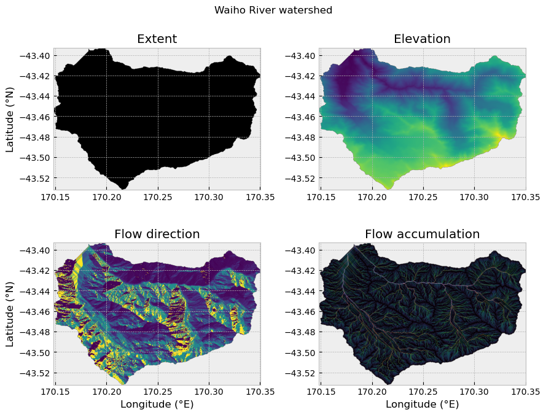

<div align="center">


### 🏔️ DEM-Based Hydrological & Geomorphological Analysis  
### *Southern Alps, New Zealand*


</div>

---

## Overview

This project analyzes watershed characteristics along the **Southern Alps of New Zealand** using **Digital Elevation Models (DEMs)** and Python-based hydrological tools.

It explores how **tectonic uplift** and **erosion (fluvial & glacial)** interact to shape landscape variability.

---

## Project Objective

- Delineate watersheds from DEM data  
- Compute geomorphological metrics  
- Compare watershed variability  
- Interpret landscape evolution processes  

---

## Study Area

- **Region:** Southern Alps, New Zealand  
- **Latitude Range:** 42.4°S – 44.0°S  
- **Tectonic Context:** Alpine Fault (Australian–Pacific plate boundary)

---

## Methodology (Interactive)

<details>
<summary><strong> Step 1: Outlet Selection</strong></summary>

- Outlet points selected manually using Google Maps  
- Defined as river exit points along western slopes  

</details>

---

<details>
<summary><strong> Step 2: DEM Conditioning</strong></summary>

- Fill pits (remove isolated sinks)  
- Fill depressions (ensure drainage continuity)  
- Resolve flats (assign flow direction)  

</details>

---

<details>
<summary><strong> Step 3: Flow Analysis</strong></summary>

- Compute flow direction  
- Compute flow accumulation  
- Identify drainage networks   

</details>

---

<details>
<summary><strong> Step 4: Watershed Delineation</strong></summary>

- Trace upstream contributing cells  
- Generate watershed boundaries  

</details>

---

## 💻 Reproducible Python Workflow

Below is a simplified example using **PySheds**:

```python
from pysheds.grid import Grid

# Load DEM
grid = Grid.from_raster('dem.tif')
dem = grid.read_raster('dem.tif')

# Fill pits
pit_filled_dem = grid.fill_pits(dem)

# Fill depressions
flooded_dem = grid.fill_depressions(pit_filled_dem)

# Resolve flats
inflated_dem = grid.resolve_flats(flooded_dem)

# Flow direction
flow_dir = grid.flowdir(inflated_dem)

# Flow accumulation
acc = grid.accumulation(flow_dir)

# Define outlet (example coordinates)
x, y = 1500000, 5200000

# Delineate watershed
catchment = grid.catchment(x=x, y=y, fdir=flow_dir, xytype='coordinate')

# Clip DEM to watershed
clipped = grid.clip_to(catchment)

# Export result
grid.to_raster(clipped, 'watershed_dem.tif')
```

---

## Workflow Summary

```text
Load DEM
   ↓
Fill Pits
   ↓
Fill Depressions
   ↓
Resolve Flats
   ↓
Flow Direction
   ↓
Flow Accumulation
   ↓
Outlet Selection
   ↓
Watershed Delineation
   ↓
Analysis & Visualization
```

---

## Results

<div align="center">



</div>

---

## Key Insights

- Watersheds show **significant variability in relief and size**  
- Areas near the Alpine Fault exhibit:
  - Steeper slopes  
  - Higher elevation gradients  
- Evidence of **tectonic–erosion coupling**  
- Spatial differences suggest varying dominance of:
  - Fluvial processes  
  - Glacial processes  

---

## Reproducibility Guide

<details>
<summary><strong> Click to expand</strong></summary>

1. Download DEM (e.g., SRTM or LiDAR)  
2. Install dependencies:
   ```bash
   pip install pysheds rasterio numpy matplotlib
   ```
3. Run preprocessing steps  
4. Define outlet points  
5. Execute watershed delineation  
6. Visualize outputs  

</details>

---

## Tools & Libraries

- Python  
- PySheds  
- Rasterio / GDAL  
- NumPy  
- Matplotlib  
- Google Maps  

---

## Future Recommendations 

- [ ] Automate outlet detection  
- [ ] Integrate glacier datasets  
- [ ] Multi-temporal DEM comparison  
- [ ] Add slope & curvature analysis  
- [ ] Perform statistical validation  

---

<div align="center">

### ⭐ Star this repo if you find it useful!

</div>
